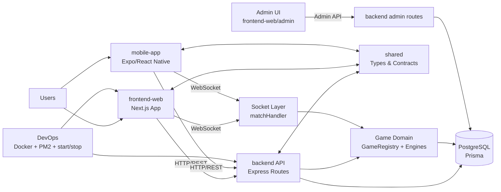

# Integrame – Site Architecture Master

Acest document este sursa principală pentru arhitectura aplicației Integrame.
Scop: onboarding rapid, implementare sigură și context clar pentru task-uri viitoare.

## 1) Platform Overview
Integrame este o platformă de puzzle gaming cu:
- backend API + WebSocket pentru multiplayer
- frontend web (Next.js)
- mobile app (Expo/React Native)
- pachet shared pentru tipuri și contracte comune

Workspace root include și orchestrare locală prin Docker + scripturi PowerShell.

## 2) Repository Structure (high-level)
- `backend/` – API, auth, matchmaking, jocuri, socket events, Prisma
- `frontend-web/` – aplicația web (App Router), UI game flows, admin pages
- `mobile-app/` – client mobil, ecrane auth/dashboard/game/result
- `shared/` – cod comun între aplicații
- `docker-compose.yml` – orchestrare locală servicii
- `start.ps1` / `stop.ps1` – start/stop stack local

### 2.1) Architecture Schema (Mermaid)

## 3) Backend Architecture
### 3.1 Core
- Entry point: `backend/src/index.ts`
- Config: `backend/src/config.ts`
- Logger: `backend/src/logger.ts`
- Prisma client: `backend/src/prisma.ts`

### 3.2 HTTP Layer
- Routes în `backend/src/routes/`:
  - auth, users, friends, invites
  - matches, stats, leaderboard
  - games, admin, logs, ai
- Middleware în `backend/src/middleware/`:
  - auth, adminAuth, errorHandler, requestLogger

### 3.3 Game Domain
- Registry și contracte:
  - `backend/src/games/GameRegistry.ts`
  - `backend/src/games/IGame.ts`
- Implementări jocuri:
  - `backend/src/games/integrame/IntegrameGame.ts`
  - `backend/src/games/maze/MazeGame.ts`

### 3.4 Realtime Layer
- Socket root: `backend/src/socket/index.ts`
- Match runtime: `backend/src/socket/matchHandler.ts`

### 3.5 Data Layer
- Prisma schema: `backend/prisma/schema.prisma`
- Migrations: `backend/prisma/migrations/`
- Seed: `backend/prisma/seed.ts`

## 4) Frontend Web Architecture
### 4.1 Framework
- Next.js App Router în `frontend-web/src/app/`
- Global styles: `globals.css`, `globals-game.css`

### 4.2 Major Areas
- Public/auth: `login`, `register`, `dashboard`, `profile`
- Gameplay pages: `games/[gameType]/play`, `integrame`, `labirinturi`, `solo`, `invite/[code]`
- Admin area: `frontend-web/src/app/admin/`

### 4.3 UI Components
- Shared components: `frontend-web/src/components/`
- Game-specific components: `frontend-web/src/components/game/`
- Game rendering abstraction:
  - `frontend-web/src/games/GameRenderer.tsx`
  - `frontend-web/src/games/IGameUI.ts`
  - `frontend-web/src/games/registry.ts`

### 4.4 Client Data & State
- API clients: `frontend-web/src/lib/api.ts`, `frontend-web/src/lib/adminApi.ts`
- Socket client: `frontend-web/src/lib/socket.ts`
- Stores: `frontend-web/src/store/`

## 5) Mobile App Architecture
- Entry/layout: `mobile-app/app/_layout.tsx`
- Screens:
  - `index`, `login`, `register`, `dashboard`, `leaderboard`, `profile`
  - `game/[matchId]`, `invite/[code]`, `result/[matchId]`
- API wrapper: `mobile-app/src/lib/api.ts`

## 6) Shared Package
- Shared exports: `shared/src/index.ts`
- Rol: tipuri, contracte și utilitare comune între backend/web/mobile.

## 7) Runtime Flows (simplified)
### 7.1 Auth Flow
1. Web/mobile login/register către backend auth routes.
2. Token/session stocat client-side.
3. Request-uri ulterioare trec prin middleware de auth.

### 7.2 Matchmaking Flow
1. Client creează/intră în match prin routes de matches/invites.
2. Backend construiește contextul de joc și jucători.
3. Socket layer sincronizează stare + mutări în timp real.
4. Stats/leaderboard se actualizează la final.

### 7.3 Game Execution Flow
1. `GameRegistry` selectează engine-ul jocului.
2. Engine validează mutări + actualizează state.
3. `matchHandler` emite evenimente către clienți.
4. Frontend renderizează prin `GameRenderer` + UI specifică jocului.

## 8) Admin Architecture
- Backend admin routes în `backend/src/routes/admin.ts`
- Frontend admin pages în `frontend-web/src/app/admin/`
- Funcție: control operațional (jocuri, invites, logs, configurări viitoare).

## 9) Configuration & Deployment
- Root PM2 config: `ecosystem.config.js`
- Dockerfiles dedicate pentru backend și frontend-web
- Local orchestration: `docker-compose.yml`
- Scripturi start/stop pentru dev local

## 10) Design Rules for Safe Changes
1. Preferă schimbări aditive, mai ales în Prisma schema.
2. Evită refactor mare în `matchHandler.ts` fără feature flags.
3. Păstrează contractele backend/web/mobile sincronizate prin `shared`.
4. Pentru joc nou:
   - adaugi engine backend
   - adaugi UI module frontend
   - înregistrezi în registry-urile relevante
5. Orice modificare la auth/matchmaking trebuie validată pe web + mobile.

## 11) Known Critical Files (high-impact)
- `backend/prisma/schema.prisma`
- `backend/src/index.ts`
- `backend/src/socket/matchHandler.ts`
- `backend/src/routes/matches.ts`
- `frontend-web/src/games/GameRenderer.tsx`
- `frontend-web/src/lib/socket.ts`
- `shared/src/index.ts`

## 12) AI Collaboration Notes
Când pornești un task nou cu AI assistant:
1. Dă link către acest document.
2. Spune explicit zona afectată (backend/web/mobile/shared).
3. Menționează dacă task-ul atinge DB, socket sau auth.
4. Cere implementare incrementală + verificare regresii.

## 13) Update Protocol
La orice schimbare arhitecturală:
- actualizează acest fișier
- adaugă intrare în changelogul relevant
- notează impactul pe fluxurile runtime

---
Last updated: 2026-03-05
Owner: Core Platform Team
